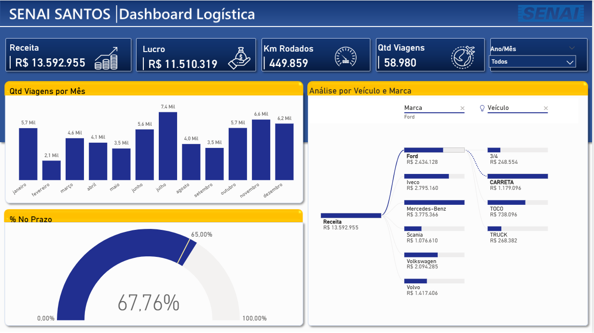
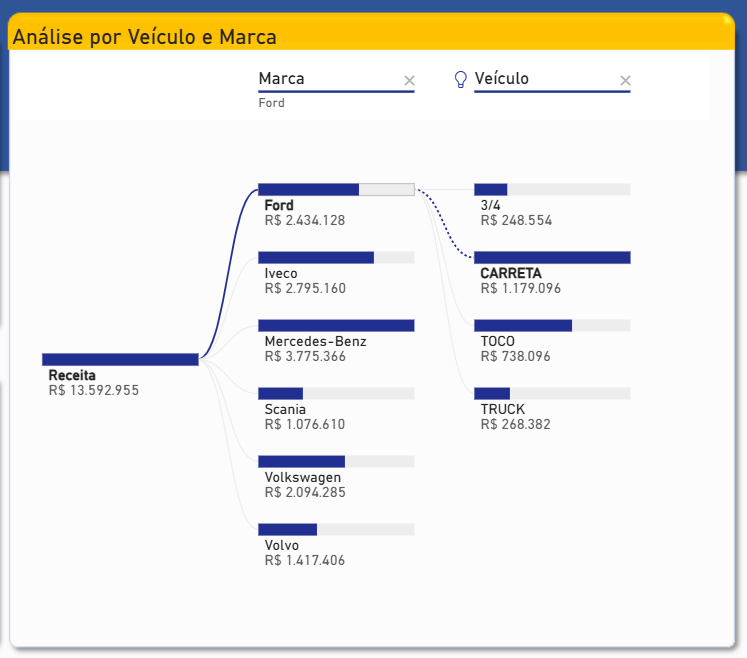

# 🚚 Hub de Logística e Performance de Frota



## 📌 O Desafio de Negócio
Uma operação logística gera um volume massivo de dados transacionais diariamente (fretes, pedágios, combustíveis, tempos de pátio). O objetivo central deste projeto foi consolidar dados de faturamento de fretes, custos de manutenção, cubagem e rotas operacionais para responder à pergunta mais crítica da diretoria: **"Quais combinações de veículos, marcas e rotas trazem a maior margem líquida com o menor índice de atraso?"**

## 🏗️ Solução Analítica e Engenharia de Dados
Para suportar uma tomada de decisão rápida e performática, a seguinte arquitetura de modelagem foi desenvolvida no Power BI / Excel:

1. **Tratamento de Dados e ETL (Power Query):** * Saneamento e padronização de registros de texto (ex: placas de veículos e nomes de motoristas duplicados ou mal preenchidos).
   * Normalização de tabelas de custos operacionais e conversão de tipos de dados para evitar erros de arredondamento em valores monetários.
   * Criação de colunas calculadas de tempo para mensurar a diferença exata entre a data de entrega prevista e a real.

2. **Modelagem de Dados (Star Schema):**
   * **Tabela Fato (`fViagens`):** Centraliza as métricas aditivas e transacionais (Volume transportado, Valor do Frete, Custo de Combustível, Km Rodados).
   * **Tabelas Dimensão (`dVeiculos`, `dMotoristas`, `dRotas`, `dCalendario`):** Permitem a filtragem cruzada e o *slice-and-dice* dos dados por qualquer cenário de negócio.

---

## 🧮 Repositório de Métricas e Lógica de Negócio (DAX)

Todas as regras de negócio foram traduzidas utilizando medidas explícitas em DAX, garantindo a eficiência do motor de cálculo e a consistência dos dados em qualquer nível de agregação visual.

### 1. Volumetria e Distância
Métricas fundamentais para o entendimento da escala operacional e distribuição de frota.

```dax
Qtd Viagens = COUNTROWS(BaseLogistica)
```

```dax
Km Rodados = SUM(BaseLogistica[Km])
```

### 2. Engenharia Financeira
Consolidação de receitas, despesas operacionais diretas e o resultado financeiro líquido das viagens realizadas.

```dax
Receita = SUM(BaseLogistica[Valor do Frete Líquido])
```

```dax
Custo = SUM(BaseLogistica[Custo Frete])
```

```dax
Lucro = [Receita] - [Custo]
```

### 3. Performance de SLA (Service Level Agreement)
Lógicas para isolar o comportamento das entregas através de modificadores de contexto de filtro (`CALCULATE`) e indicadores de eficiência percentual.

```dax
Viagens no Prazo = 
CALCULATE(
    COUNTROWS(BaseLogistica),
    BaseLogistica[Status Entrega] = "No Prazo"
)
```

```dax
Viagens Atrasadas = 
CALCULATE(
    COUNTROWS(BaseLogistica),
    BaseLogistica[Status Entrega] = "Atrasado"
)
```

```dax
% No Prazo = [Viagens no Prazo] / [Qtd Viagens]
```

```dax
% Atrasado = [Viagens Atrasadas] / [Qtd Viagens]
```

---

## 💡 Engenharia de UX/UI: A Árvore de Decomposição
O grande destaque técnico e visual deste painel é a implementação da **Árvore de Decomposição (*Decomposition Tree*)**. 



Em vez de prender o usuário em relatórios estáticos, essa funcionalidade permite que o gestor clique no faturamento ou lucro total e escolha dinamicamente por qual caminho quer quebrar o dado (ex: *Quero abrir a receita primeiro por Rota, depois ver qual Marca de caminhão rodou nela, e por fim qual veículo específico performou pior*). Isso reduz o tempo de descoberta de gargalos operacionais de horas para poucos cliques.
