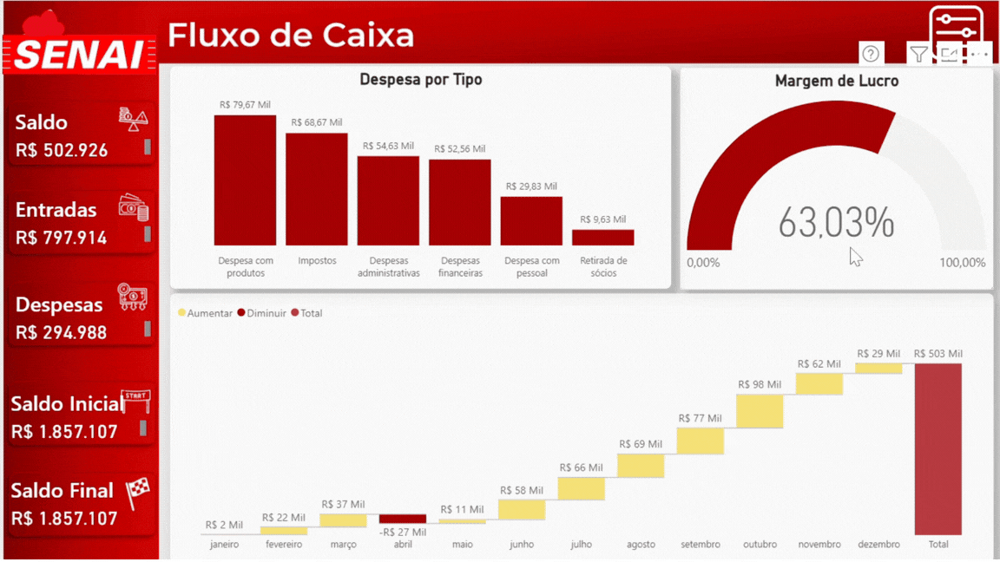

# 💰 Engenharia Financeira & Fluxo de Caixa



## 📌 O Desafio de Negócio
A falta de previsibilidade financeira é um dos maiores riscos para qualquer operação. Este projeto substitui fluxos de caixa baseados em planilhas manuais isoladas por um modelo analítico automatizado, capaz de mostrar a saúde financeira, despesas operacionais e a margem de lucro real de forma clara, auditável e dinâmica.

## 🏗️ Solução Analítica e Engenharia de Dados
O maior desafio na engenharia de dados financeiros é lidar com lançamentos de naturezas diferentes (créditos vs. débitos). A arquitetura foi definida assim:

1. **Modelagem de Plano de Contas (Dimensão Hierárquica):** * Estruturação de um modelo que permite a consolidação dos dados desde a visão macro (Receitas Totais) até a visão micro de contas específicas.
2. **ETL e Transformação (Power Query):**
   * Normalização das bases financeiras para o formato tabular ideal (Data, Conta, Valor, Tipo de Movimentação), garantindo a performance do modelo de dados.
3. **Modelagem Star Schema:**
   * Tabela Fato conectada à dimensão de Calendário para habilitar a inteligência de tempo e a projeção de saldos.

---

## 🧮 Repositório de Métricas e Lógica de Negócio (DAX)

A construção deste fluxo de caixa exigiu que as métricas conversassem entre si, respeitando rigorosamente o que soma e o que subtrai do caixa da empresa através de manipulação avançada de contexto.

### 1. Entradas e Saídas Base
Isolamento dos fluxos utilizando a classificação da movimentação. Note a inversão matemática de sinal (`-CALCULATE`) aplicada nas saídas para viabilizar a visualização em cascata.

```dax
Entradas = 
CALCULATE(
    SUM('Movimentações'[Valor]),
    'Movimentações'[Movimentação] = "Entradas"
)
```

```dax
Saídas = 
-CALCULATE(
    SUM('Movimentações'[Valor]),
    'Movimentações'[Movimentação] = "Saídas"
)
```

### 2. Resultado e Margem
Cálculo do dinheiro que efetivamente transita na operação e a margem percentual correspondente.

```dax
Saldo = SUM('Movimentações'[Valor])
```

```dax
Margem de Lucro = [Saldo] / [Entradas]
```

### 3. Saldo de Fechamento de Período
Métrica avançada para capturar o exato momento de fechamento do caixa. Utiliza a função `LOOKUPVALUE` em conjunto com `MAX` para identificar o índice da última movimentação registrada no período avaliado e resgatar o valor acumulado correspondente.

```dax
Saldo Final Período = 
LOOKUPVALUE(
    'Movimentações'[Acumulado],
    'Movimentações'[Núm. Movimentação],
    MAX('Movimentações'[Núm. Movimentação])
)
```

---

## 💡 Destaque de UX/UI: O Gráfico de Cascata (Waterfall)

A melhor prática de visualização para análises financeiras é o **Gráfico de Cascata (*Waterfall*)**. 


Neste painel, ele foi implementado para ilustrar visualmente a "ponte" entre o saldo inicial e o saldo final. O gestor consegue ver exatamente qual categoria "puxou" o saldo para baixo ao longo do mês, permitindo cortes cirúrgicos de custos com base em dados, e não em intuição.
