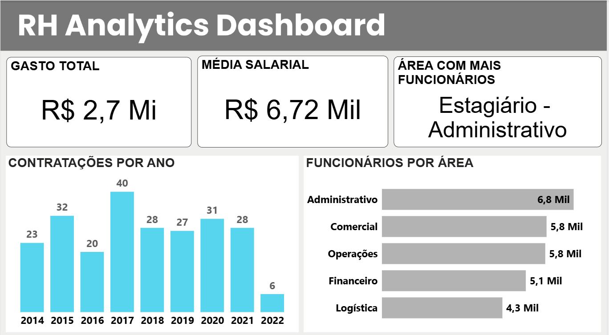

# 📂 Projetos Adicionais: People Analytics & Manufatura

Esta seção compila painéis táticos e operacionais desenvolvidos para resolver dores específicas de departamentos de Recursos Humanos e Chão de Fábrica, demonstrando versatilidade na análise de diferentes modelos de negócio.

---

## 👥 1. People Analytics (Gestão de RH)

O departamento de RH deixou de ser apenas operacional para se tornar um parceiro estratégico. Este modelo analítico foi desenvolvido para monitorar o ciclo de vida do colaborador, custos de folha e alocação de talentos.

### 📌 Focos da Análise
* **Gestão de Headcount e Turnover:** Acompanhamento histórico de contratações por ano, mapeando o volume de força de trabalho distribuído por cada área da empresa (Administrativo, Comercial, Operações, Logística e Financeiro).
* **Engenharia de Cargos e Salários:** Análise do custo total de folha (R$ 2,7 Mi) cruzado com os níveis hierárquicos (Gerente, Estagiário, Diretor, Analista), permitindo identificar distorções na média salarial.
* **Eficiência Operacional (Horas Extras):** Implementação de *Tooltips* (dicas de ferramenta dinâmicas) para inspecionar rapidamente o volume e o custo financeiro de horas extras por cargo, isolando gargalos de sobrecarga de trabalho.

---

## ⚙️ 2. OEE & Produção Industrial (Manufatura)

Na indústria, cada minuto de máquina parada ou produto defeituoso impacta diretamente a margem do negócio. Este painel foi construído focado nos princípios de **OEE (*Overall Equipment Effectiveness*)**.

### 📌 Focos da Análise
* **Volume e Qualidade:** Acompanhamento do total de peças produzidas versus a quantidade de itens rejeitados (refugo), gerando o indicador exato de Qualidade da operação.
* **Disponibilidade de Máquina:** Monitoramento rigoroso do tempo de ciclo, cruzando **Horas Produtivas** contra **Horas Paradas**. O ponteiro de Disponibilidade (82,66%) indica o quão perto a fábrica está da sua capacidade máxima teórica.
* **Sazonalidade e Turnos:** Histórico de produção mensal filtrável por operador, permitindo avaliar a performance individual e a consistência da linha de montagem ao longo do ano.
